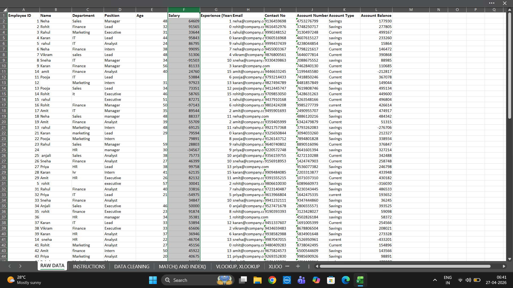
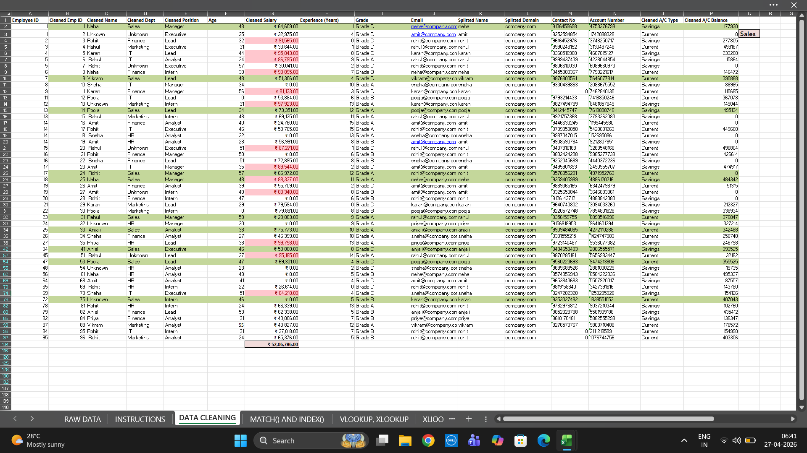
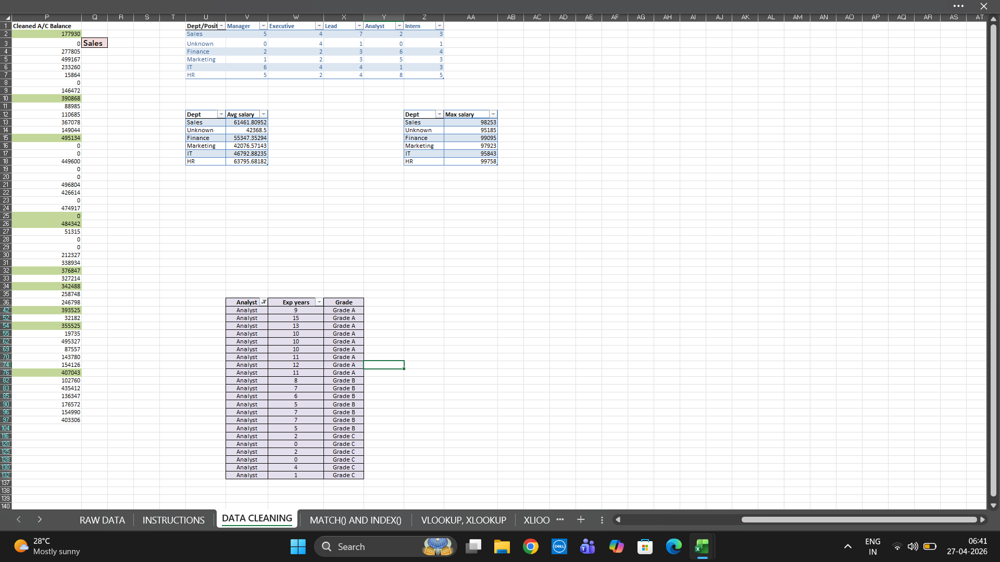
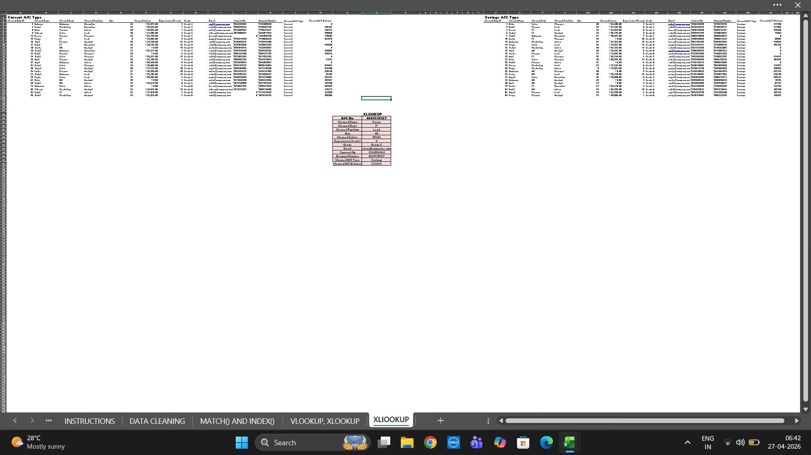
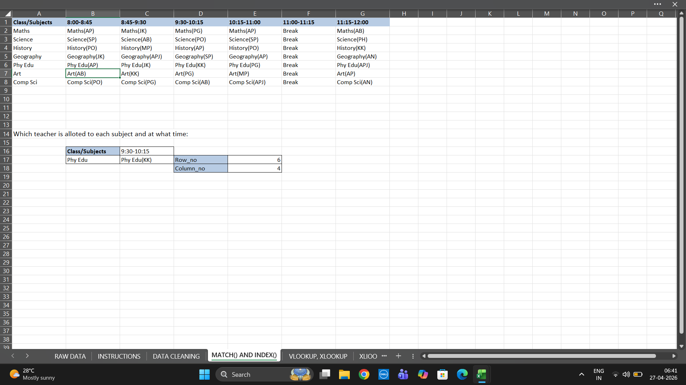

# Excel Employee Data Analysis Project

## Overview
This project focuses on analyzing employee data using Microsoft Excel. It involves data cleaning, applying formulae, and extracting meaningful insights.

## Objective
* Clean and structure raw data
* Apply Excel formulae for analysis
* Use lookup functions for data retrieval
* Identify patterns and insights

## Dataset
* Type: Employee Data
* Fields: Name, Department, Salary, Email, Account Details

## Data Cleaning
* Removed inconsistencies and formatting issues
* Handled missing and duplicate values
* Standardized data for better analysis

## Tools & Functions Used
* Conditional Formatting
* Logical Functions
* VLOOKUP & XLOOKUP
* INDEX & MATCH
* Statistical Functions

## Key Insights
* Improved data accuracy through cleaning
* Efficient data retrieval using lookup functions
* Converted raw data into structured format

## Screenshots

### Raw Data

### Data Cleaning & Formatting

### Logical Functions & Statistical Formulae

### Lookup

### Index & Match

## Conclusion
This project demonstrates strong Excel skills including data cleaning, logical analysis, and advanced lookup techniques.
